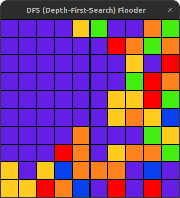
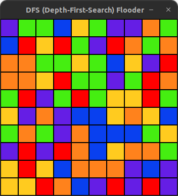
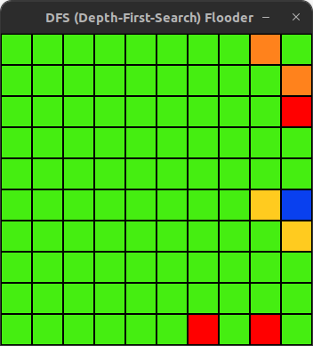

# Color-Flooder-DFS

## Introduction

This is a simple, interactive color flooding game developed in Java using the Swing framework. The game logic is primarily based on the Depth-First Search (DFS) algorithm. The purpose of this project is to create a fun and visual approach to understanding and implementing the DFS algorithm.

## Game Mechanics

The game starts with a grid filled with random colors. When a cell is clicked, it changes the color of the initial grid cell (top-left) and all connected cells to the clicked cell's color. The objective is to fill the grid with a single color in the fewest number of steps.

## Getting Started

### Prerequisites

Ensure you have the following installed on your local machine:

- Java (version 8 or above)

### Running the game

1. Clone this repository to your machine.
2. Navigate to the root directory in your terminal.
3. Compile the Main.java file: `javac Main.java`
4. Run the compiled Main class: `java Main`

## Technology Used

- Java
- Swing for GUI

## Screenshots

Here are a few screenshots of the game:

